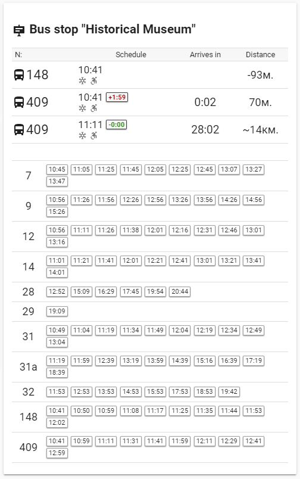

# VPT-Card
 Lovelace custom card for Home Assistant's Varna Public Transport custom component

This Lovelace custom card shows bus stop information for city of Varna, Bulgaria public transport

The card depends on the Varna Public Transport (VPT) custom component which you can find at
[https://github.com/Serios/VPT](https://github.com/Serios/VPT/).

 

#### Installation
Download varna_pt_card.js and put it into $homeassistant_config_dir/www/ 

#### Lovelace UI configuration
