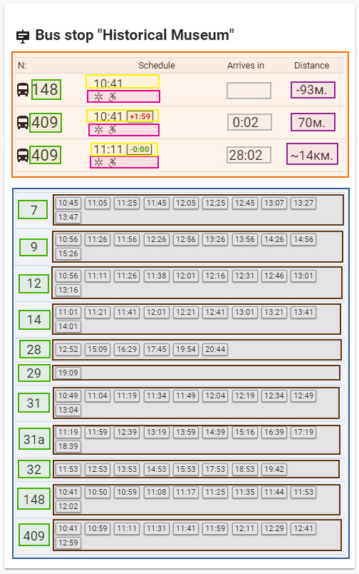

# VPT-Card
 Lovelace custom card for Home Assistant's Varna Public Transport custom component

This Lovelace custom card shows bus stop information for city of Varna, Bulgaria public transport
The card depends on the Varna Public Transport (VPT) custom component which you can find at
[https://github.com/Serios/VPT](https://github.com/Serios/VPT/).


### Features
* 3 available modes of displaying data - only dislpays the data you need
* Configurable styles trough settings or trough theme.yaml
* Available in 3 languages


### Installation
1. Download varna_pt_card.js and put it into $homeassistant_config_dir/www/ dir<br />

2. Add a reference to `varna_pt_card.js` inside your `ui-lovelace.yaml`

  ```yaml
  resources:
    - url: /local/varna_pt_card.js?v=0.1
      type: module
  ```

### Card configuration

| Name | Type |         | Default | Description |
|------|------|---------|---------|-------------|
| type | string | **required** | `custom:varna-pt-stop-card` |  |
| entity | string | **required** | `sensor.varna_public_transport` |  |
| locale | string | optional | en | In what language to display the card. Available values are: en, bg, ru. See [Translations](#translations) |
| vptstyles |  | optional |  | See [Styling](#Styling) |

Example of basic config

```yaml
- type: "custom:varna-pt-stop-card"
- entity: sensor.varna_public_transport
```

Example of config with language defined

```yaml
- type: "custom:varna-pt-stop-card"
  entity: sensor.varna_public_transport
  locale: 'ru'
```


### Translations
There are couple of lang strings that are translated. Bu default if no locale is set, the card will load in English
If you wish to add translation feel free to make a pull request or contact me and I will send you the texts which need to be translated and add them afterwards.
Available languages: `English, Bulgarian, Russian`


### Styling
You can change various styles of the card by setting them in config or if you use Themes you can add them to the theme file.
Keep in mind that, styles set in config are with priority over styles set in the theme file.

| Config var | Theme var | Acceptable value | Description |
|------------|-----------|------------------|-------------|
| `VPTMainColor` | `VPT-main-color` | Any hex color value. See [W3C specs](https://www.w3schools.com/cssref/css_colors.asp) | Controls the text color of entire card
| `VPTSecondColor` | `VPT-secondary-color` | Any hex color value. See [W3C specs](https://www.w3schools.com/cssref/css_colors.asp) | Controls the color of icons showing vehicle extras in `Live data` section
| `VPTHeaderBG` | `VPT-header-background` | Any valid background property (hex, RGB, RGBA, HSL, HSLA...) [W3C specs](https://www.w3schools.com/cssref/css3_pr_background.asp) | Controls the background color of `Live data` section table header
| `VPTBordersColor` | `VPT-borders-color` | Any hex color value. See [W3C specs](https://www.w3schools.com/cssref/css_colors.asp) | Controls the color of all borders/delimiters
| `VPTDelayBG` | `VPT-delay-background` | Any valid background property (hex, RGB, RGBA, HSL, HSLA...) [W3C specs](https://www.w3schools.com/cssref/css3_pr_background.asp) | Controls the color of delay pads in `Live data` section
| `VPTDelayBorder` | `VPT-delay-border` | Any hex color value. See [W3C specs](https://www.w3schools.com/cssref/css_colors.asp) | Controls the color of delay pads borders in `Live data` section
| `VPTLateColor` | `VPT-late-color` | Any hex color value. See [W3C specs](https://www.w3schools.com/cssref/css_colors.asp) | Controls the color of text (when the vehicle is arriving late) in delay pad in `Live data` section
| `VPTEarlyColor` | `VPT-early-color` | Any hex color value. See [W3C specs](https://www.w3schools.com/cssref/css_colors.asp) | Controls the color of text (when the vehicle is arriving early) in delay pad in `Live data` section
| `VPTSchePadBG` | `VPT-sche-pad-bg` | Any valid background property (hex, RGB, RGBA, HSL, HSLA...) [W3C specs](https://www.w3schools.com/cssref/css3_pr_background.asp) | Controls the background color of times pads in `Schedules` section
| `VPTSchePadBorder` | `VPT-sche-pad-border` | Any hex color value. See [W3C specs](https://www.w3schools.com/cssref/css_colors.asp) | Controls the color of borders of times pads in `Schedules` section
| `VPTSchePadText` | `VPT-sche-pad-text` | Any hex color value. See [W3C specs](https://www.w3schools.com/cssref/css_colors.asp) | Controls the color of text in times pads in `Schedules` section




Red - Live data section

Green - Line number

Yellow - Next schedule time at which the vehicle should be on the stop + delay pad

Pink - Vehicle extras

Gray - Time remaining till vehicle arrival at the stop

Purple - Distance of vehicle to the stop

Blue - Schedules section

Brown - Schedule times pads


Some examples:

```yaml
- type: "custom:varna-pt-stop-card"
  entity: sensor.varna_public_transport
  vptstyles:
    - VPTMainColor: '#000000'
    - VPTBordersColor: '#ff0000'
```


```yaml
- type: "custom:varna-pt-stop-card"
  entity: sensor.varna_public_transport
  locale: 'ru'
  vptstyles:
    - VPTHeaderBG: 'rgba(240,240,240, 0.5)'
    - VPTLateColor: '#b80000'
    - VPTEarlyColor: '#1b8e00'
```


theme.yaml
```yaml
   VPTHeaderBG: 'rgba(240,240,240, 0.5)'
   VPTLateColor: '#b80000'
   VPTEarlyColor: '#1b8e00'
```

 ### Updating

Just download the latest files and overwrite what you already have. Don't forget to `?v=X` set X to the actual version in your resources call. If you not using the parameter clear the browser cache.